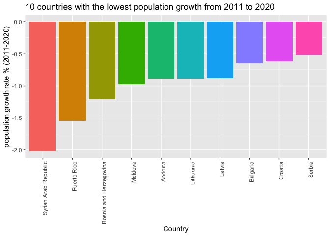

World Population
================
Youn-Jeong Choi
2023-09-22

### 1. Pivot world_pop_data and combine two data.

``` r
# load and pivot world_pop_data
world_pop <- read_csv('data/world_pop_data.csv.gz', show_col_types = FALSE)
head(world_pop)
```

    ## # A tibble: 6 × 64
    ##   `Country Code` `Indicator Name`  `Indicator Code`  `1960` `1961` `1962` `1963`
    ##   <chr>          <chr>             <chr>              <dbl>  <dbl>  <dbl>  <dbl>
    ## 1 ABW            Population, total SP.POP.TOTL       5.42e4 5.54e4 5.62e4 5.67e4
    ## 2 AFE            Population, total SP.POP.TOTL       1.31e8 1.34e8 1.38e8 1.41e8
    ## 3 AFG            Population, total SP.POP.TOTL       9.00e6 9.17e6 9.35e6 9.54e6
    ## 4 AFW            Population, total SP.POP.TOTL       9.64e7 9.84e7 1.01e8 1.03e8
    ## 5 AGO            Population, total SP.POP.TOTL       5.45e6 5.53e6 5.61e6 5.68e6
    ## 6 ALB            Population, total SP.POP.TOTL       1.61e6 1.66e6 1.71e6 1.76e6
    ## # ℹ 57 more variables: `1964` <dbl>, `1965` <dbl>, `1966` <dbl>, `1967` <dbl>,
    ## #   `1968` <dbl>, `1969` <dbl>, `1970` <dbl>, `1971` <dbl>, `1972` <dbl>,
    ## #   `1973` <dbl>, `1974` <dbl>, `1975` <dbl>, `1976` <dbl>, `1977` <dbl>,
    ## #   `1978` <dbl>, `1979` <dbl>, `1980` <dbl>, `1981` <dbl>, `1982` <dbl>,
    ## #   `1983` <dbl>, `1984` <dbl>, `1985` <dbl>, `1986` <dbl>, `1987` <dbl>,
    ## #   `1988` <dbl>, `1989` <dbl>, `1990` <dbl>, `1991` <dbl>, `1992` <dbl>,
    ## #   `1993` <dbl>, `1994` <dbl>, `1995` <dbl>, `1996` <dbl>, `1997` <dbl>, …

``` r
new_world_pop <- world_pop %>% 
  pivot_longer('1960':'2020', names_to = "year", values_to = "total_pop") %>% 
  mutate(year = as.integer(year)) %>% 
  select(-'Indicator Name', -'Indicator Code')
head(new_world_pop)
```

    ## # A tibble: 6 × 3
    ##   `Country Code`  year total_pop
    ##   <chr>          <int>     <dbl>
    ## 1 ABW             1960     54208
    ## 2 ABW             1961     55434
    ## 3 ABW             1962     56234
    ## 4 ABW             1963     56699
    ## 5 ABW             1964     57029
    ## 6 ABW             1965     57357

``` r
# load metadata_country data 
metadata <- read_csv('data/metadata_country.csv.gz', show_col_types = FALSE)
head(metadata)
```

    ## # A tibble: 6 × 5
    ##   `Country Code` Region                    IncomeGroup    SpecialNotes TableName
    ##   <chr>          <chr>                     <chr>          <chr>        <chr>    
    ## 1 ABW            Latin America & Caribbean High income    <NA>         Aruba    
    ## 2 AFE            <NA>                      <NA>           26 countrie… Africa E…
    ## 3 AFG            South Asia                Low income     Fiscal year… Afghanis…
    ## 4 AFW            <NA>                      <NA>           22 countrie… Africa W…
    ## 5 AGO            Sub-Saharan Africa        Lower middle … <NA>         Angola   
    ## 6 ALB            Europe & Central Asia     Upper middle … <NA>         Albania

``` r
# check the elements of Country Code variable which are not shared between two data. 
length(unique(new_world_pop$`Country Code`))
```

    ## [1] 266

``` r
length(unique(metadata$'Country Code'))
```

    ## [1] 265

``` r
new_world_pop %>% anti_join(metadata, by = "Country Code")
```

    ## # A tibble: 61 × 3
    ##    `Country Code`  year total_pop
    ##    <chr>          <int>     <dbl>
    ##  1 INX             1960        NA
    ##  2 INX             1961        NA
    ##  3 INX             1962        NA
    ##  4 INX             1963        NA
    ##  5 INX             1964        NA
    ##  6 INX             1965        NA
    ##  7 INX             1966        NA
    ##  8 INX             1967        NA
    ##  9 INX             1968        NA
    ## 10 INX             1969        NA
    ## # ℹ 51 more rows

``` r
# combine two data
one.table <- merge(new_world_pop, metadata, by = "Country Code", all.y = TRUE)
head(one.table)
```

    ##   Country Code year total_pop                    Region IncomeGroup
    ## 1          ABW 1975     60653 Latin America & Caribbean High income
    ## 2          ABW 1974     60527 Latin America & Caribbean High income
    ## 3          ABW 1970     59070 Latin America & Caribbean High income
    ## 4          ABW 1971     59442 Latin America & Caribbean High income
    ## 5          ABW 1972     59849 Latin America & Caribbean High income
    ## 6          ABW 1973     60236 Latin America & Caribbean High income
    ##   SpecialNotes TableName
    ## 1         <NA>     Aruba
    ## 2         <NA>     Aruba
    ## 3         <NA>     Aruba
    ## 4         <NA>     Aruba
    ## 5         <NA>     Aruba
    ## 6         <NA>     Aruba

### 2. Which countries have experienced the highest population growth from 1960 to 2020?

``` r
# organize the combined table.
pop <- one.table %>%
  select(-SpecialNotes) %>%
  arrange(TableName, year)
head(pop)
```

    ##   Country Code year total_pop     Region IncomeGroup   TableName
    ## 1          AFG 1960   8996967 South Asia  Low income Afghanistan
    ## 2          AFG 1961   9169406 South Asia  Low income Afghanistan
    ## 3          AFG 1962   9351442 South Asia  Low income Afghanistan
    ## 4          AFG 1963   9543200 South Asia  Low income Afghanistan
    ## 5          AFG 1964   9744772 South Asia  Low income Afghanistan
    ## 6          AFG 1965   9956318 South Asia  Low income Afghanistan

``` r
# find top 10 countries with the highest population growth from 1960 to 2020.
pop_growth <- pop %>%
  group_by(TableName) %>%
  filter(year %in% c(1960, 2020)) %>%
  summarize(population_growth = ((total_pop[year == 2020] - total_pop[year == 1960])/total_pop[year == 1960]*100)) %>%
  arrange(desc(population_growth)) %>% 
  slice_max(population_growth, n=10) 
head(pop_growth)
```

    ## # A tibble: 6 × 2
    ##   TableName                 population_growth
    ##   <chr>                                 <dbl>
    ## 1 United Arab Emirates                 10602.
    ## 2 Qatar                                 5980.
    ## 3 Kuwait                                1487.
    ## 4 Sint Maarten (Dutch part)             1341.
    ## 5 Djibouti                              1081.
    ## 6 Jordan                                 993.

``` r
# visualization of top 10 countries
p <- pop_growth %>% 
  mutate(TableName = reorder(TableName, desc(population_growth))) %>% 
  ggplot(aes(TableName, population_growth, fill = TableName)) + 
  geom_bar(stat = "identity") +
  theme(axis.text.x = element_text(angle = 90, hjust =1)) +
  xlab("Country") + 
  ylab("population_growth % (yr2020/yr1960)") +
  ggtitle("Top 10 countries with the highest population growth from year 1960 to year 2020") +
  theme(legend.position="none") 
p
```

<!-- -->

### 3. compare average population growth rate for the last 10 years among countries.

``` r
# filter out from year 2011 to year 2020 and create two variables representing the difference of population every year
# and population growth rate, respectively, and summarize average growth rate of each country.
ave_pop_growth <- pop %>% 
  group_by(TableName) %>%
  filter(year %in% c(2011, 2012, 2013, 2014, 2015, 2016, 2017, 2018, 2019, 2020)) %>% 
  mutate(diff_pop = total_pop -lag(total_pop), 
         growth_rate = diff_pop / lag(total_pop)*100) %>% 
  summarize(ave_growth_rate = mean(growth_rate, na.rm = TRUE))
head(ave_pop_growth)
```

    ## # A tibble: 6 × 2
    ##   TableName                   ave_growth_rate
    ##   <chr>                                 <dbl>
    ## 1 Afghanistan                           2.89 
    ## 2 Africa Eastern and Southern           2.70 
    ## 3 Africa Western and Central            2.72 
    ## 4 Albania                              -0.261
    ## 5 Algeria                               2.01 
    ## 6 American Samoa                       -0.112

``` r
# Select 10 countries with highest population growth, and 10 with lowest population growth.
top_ten_countries <- ave_pop_growth %>%  slice_max(ave_growth_rate, n =10)
bottom_ten_countries <- ave_pop_growth %>%  slice_min(ave_growth_rate, n =10)
top_ten_countries
```

    ## # A tibble: 10 × 2
    ##    TableName         ave_growth_rate
    ##    <chr>                       <dbl>
    ##  1 Oman                         5.16
    ##  2 Equatorial Guinea            3.99
    ##  3 Maldives                     3.98
    ##  4 Qatar                        3.95
    ##  5 Niger                        3.93
    ##  6 Uganda                       3.53
    ##  7 Angola                       3.45
    ##  8 Kuwait                       3.38
    ##  9 Congo, Dem. Rep.             3.32
    ## 10 Jordan                       3.24

``` r
bottom_ten_countries
```

    ## # A tibble: 10 × 2
    ##    TableName              ave_growth_rate
    ##    <chr>                            <dbl>
    ##  1 Syrian Arab Republic            -2.02 
    ##  2 Puerto Rico                     -1.55 
    ##  3 Bosnia and Herzegovina          -1.21 
    ##  4 Moldova                         -0.975
    ##  5 Andorra                         -0.888
    ##  6 Lithuania                       -0.886
    ##  7 Latvia                          -0.884
    ##  8 Bulgaria                        -0.653
    ##  9 Croatia                         -0.621
    ## 10 Serbia                          -0.511

``` r
top_10 <- top_ten_countries %>% 
  mutate(TableName = reorder(TableName, desc(ave_growth_rate))) %>% 
  ggplot(aes(TableName, ave_growth_rate, fill = TableName)) + 
  geom_bar(stat = "identity") +
  theme(axis.text.x = element_text(angle = 90, hjust =1)) +
  xlab("Country") + 
  ylab("population growth rate % (2011-2020)") +
  ggtitle("Top 10 countries with the highest population growth from 2011 to 2020") +
  theme(legend.position="none") 
top_10
```

<!-- -->

``` r
bottom_10 <- bottom_ten_countries %>% 
  mutate(TableName = reorder(TableName, ave_growth_rate)) %>% 
  ggplot(aes(TableName, ave_growth_rate, fill = TableName)) + 
  geom_bar(stat = "identity") +
  theme(axis.text.x = element_text(angle = 90, hjust =1)) +
  xlab("Country") + 
  ylab("population growth rate % (2011-2020)") +
  ggtitle("10 countries with the lowest population growth from 2011 to 2020") +
  theme(legend.position="none") 
bottom_10
```

<!-- -->

### 4. Create a plot that visualizes the population growth of countries over time grouped by region.

``` r
#group the dataframe by Region and year and create a variable showing average of total population each year by region
pop_growth_region <- pop %>%
  filter(!is.na(Region)) %>% 
  group_by(Region, year) %>% 
  mutate(ave_pop = mean(total_pop)/1000000)
head(pop_growth_region)
```

    ## # A tibble: 6 × 7
    ## # Groups:   Region, year [6]
    ##   `Country Code`  year total_pop Region     IncomeGroup TableName   ave_pop
    ##   <chr>          <int>     <dbl> <chr>      <chr>       <chr>         <dbl>
    ## 1 AFG             1960   8996967 South Asia Low income  Afghanistan    71.6
    ## 2 AFG             1961   9169406 South Asia Low income  Afghanistan    73.1
    ## 3 AFG             1962   9351442 South Asia Low income  Afghanistan    74.7
    ## 4 AFG             1963   9543200 South Asia Low income  Afghanistan    76.3
    ## 5 AFG             1964   9744772 South Asia Low income  Afghanistan    78.0
    ## 6 AFG             1965   9956318 South Asia Low income  Afghanistan    79.7

``` r
pop_growth_region %>% ggplot(aes(year, ave_pop, color = Region)) + 
  geom_line() +
  ylab("population in millons") +
  ggtitle("Population growth over time by Region ")
```

    ## Warning: Removed 1062 rows containing missing values (`geom_line()`).

<!-- -->

### 5. Which countries in South Asia show highest population growth over time?

``` r
south_asia <- pop %>%
  filter(Region == "South Asia") %>% 
  group_by(TableName) %>% 
  mutate(total_pop = total_pop/1000000)
head(south_asia)
```

    ## # A tibble: 6 × 6
    ## # Groups:   TableName [1]
    ##   `Country Code`  year total_pop Region     IncomeGroup TableName  
    ##   <chr>          <int>     <dbl> <chr>      <chr>       <chr>      
    ## 1 AFG             1960      9.00 South Asia Low income  Afghanistan
    ## 2 AFG             1961      9.17 South Asia Low income  Afghanistan
    ## 3 AFG             1962      9.35 South Asia Low income  Afghanistan
    ## 4 AFG             1963      9.54 South Asia Low income  Afghanistan
    ## 5 AFG             1964      9.74 South Asia Low income  Afghanistan
    ## 6 AFG             1965      9.96 South Asia Low income  Afghanistan

``` r
south_asia_plot <- south_asia %>% ggplot(aes(year, total_pop, color = TableName)) + 
  geom_line() +
  ylab("population in millons") +
  labs(color = "country") +
  ggtitle("Population growth over time in South Asia ")
south_asia_plot
```

<!-- -->

### 6. Which countries in Middle East & North Africa show the highest population growth over time?

``` r
middle_east_north_africa <- pop %>%
  filter(Region == "Middle East & North Africa") %>% 
  group_by(TableName) %>% 
  mutate(total_pop = total_pop/1000000)
head(middle_east_north_africa)
```

    ## # A tibble: 6 × 6
    ## # Groups:   TableName [1]
    ##   `Country Code`  year total_pop Region                    IncomeGroup TableName
    ##   <chr>          <int>     <dbl> <chr>                     <chr>       <chr>    
    ## 1 DZA             1960      11.1 Middle East & North Afri… Lower midd… Algeria  
    ## 2 DZA             1961      11.3 Middle East & North Afri… Lower midd… Algeria  
    ## 3 DZA             1962      11.6 Middle East & North Afri… Lower midd… Algeria  
    ## 4 DZA             1963      11.9 Middle East & North Afri… Lower midd… Algeria  
    ## 5 DZA             1964      12.2 Middle East & North Afri… Lower midd… Algeria  
    ## 6 DZA             1965      12.6 Middle East & North Afri… Lower midd… Algeria

``` r
middle_east_north_africa_plot <- middle_east_north_africa %>% ggplot(aes(year, total_pop, color = TableName)) + 
  geom_line() +
  ylab("population in millons") +
  ggtitle("Population growth over time in Middle East & North Africa ") +
  labs(color = "Country")
middle_east_north_africa_plot 
```

    ## Warning: Removed 30 rows containing missing values (`geom_line()`).

<!-- -->

### 7. How does income group affect a country’s population growth?

``` r
pop_growth_by_income <- pop %>%
  filter(!is.na(IncomeGroup)) %>%
  group_by(IncomeGroup, year) %>% 
  mutate(ave_pop_by_income = mean(total_pop, na.rm = TRUE)/1000000)
head(pop_growth_by_income)
```

    ## # A tibble: 6 × 7
    ## # Groups:   IncomeGroup, year [6]
    ##   `Country Code`  year total_pop Region  IncomeGroup TableName ave_pop_by_income
    ##   <chr>          <int>     <dbl> <chr>   <chr>       <chr>                 <dbl>
    ## 1 AFG             1960   8996967 South … Low income  Afghanis…              5.10
    ## 2 AFG             1961   9169406 South … Low income  Afghanis…              5.22
    ## 3 AFG             1962   9351442 South … Low income  Afghanis…              5.33
    ## 4 AFG             1963   9543200 South … Low income  Afghanis…              5.45
    ## 5 AFG             1964   9744772 South … Low income  Afghanis…              5.58
    ## 6 AFG             1965   9956318 South … Low income  Afghanis…              5.71

``` r
pop_growth_by_income %>% 
  ggplot(aes(year, ave_pop_by_income, color = IncomeGroup)) + 
  geom_line() + 
 ylab("population in millions") +
 ggtitle("Population growth over time by income")
```

<!-- -->
